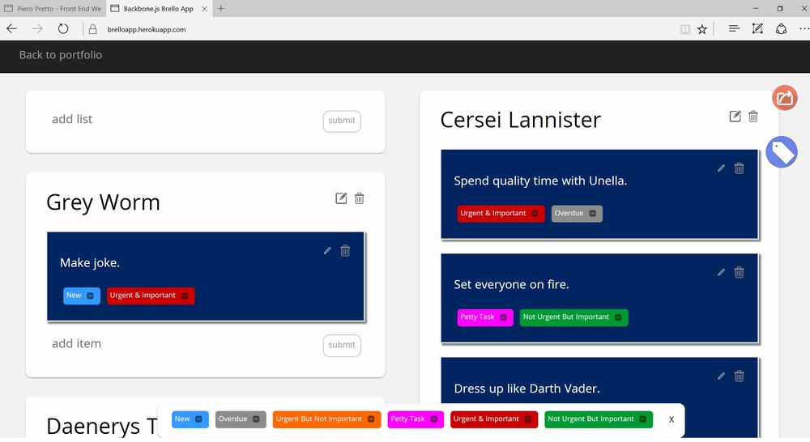

# Trello BackboneJS App
Backbone.js application utilizing mongoose population methods to link together JSON objects into custom lists. Passport.js allows each user to have their own secure profile.

## Instructions

View the live demo on my [Heroku site](http://brelloapp.herokuapp.com).

